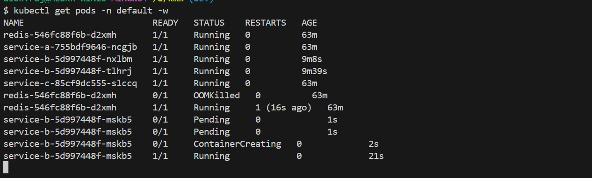
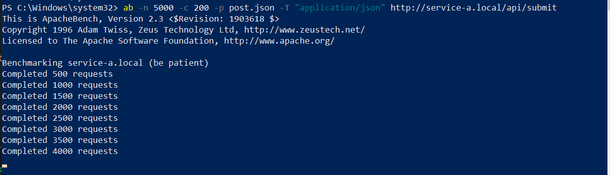
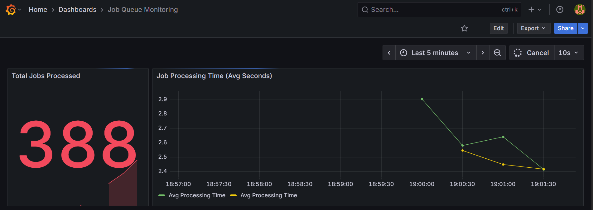
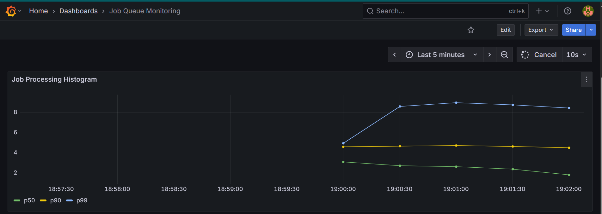
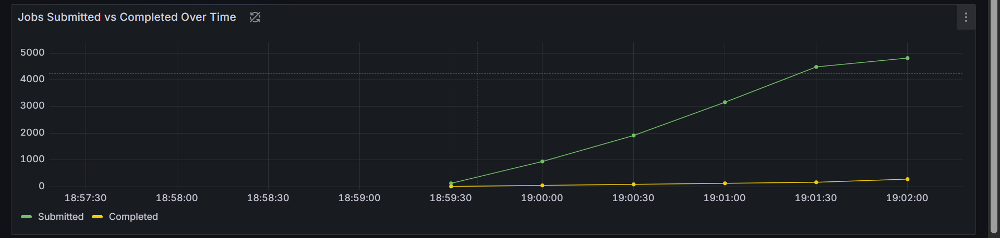

````markdown
# Microservices on Minikube with Monitoring & Autoscaling

## 1. Prerequisites

- [Minikube](https://minikube.sigs.k8s.io/docs/start/)
- [kubectl](https://kubernetes.io/docs/tasks/tools/)
- Apache Bench (`ab`) for stress testing

```bash
# Linux
sudo apt install apache2-utils

# Windows (via Chocolatey)
choco install apache-httpd -y
````

---

## 2. Clone Repo

```bash
git clone https://github.com/alokrajmindfire/Kubernetes-Microservices-Monitoring.git
cd Kubernetes-Microservices-Monitoring
```

---

## 3. Configure Docker Username

1. **Set Docker username in `build-images.sh`**:

```bash
DOCKER_USERNAME=<your-docker-username>
```

2. **Update Kubernetes deployments** to use your Docker images:

* `k8s/deployment/deployment-a.yaml`
* `k8s/deployment/deployment-b.yaml`
* `k8s/deployment/deployment-c.yaml`

Example:

```yaml
spec:
  containers:
    - name: service-a
      image: <your-docker-username>/service-a:0.1
```

---

## 4. Deploy to Minikube

```bash
cd script
chmod +x ./build-images.sh ./deploy.sh

# Build Docker images with your username
./build-images.sh

# Deploy all manifests and services
./deploy.sh
```

Verify deployment:

```bash
kubectl get pods -A
kubectl get svc -A
```

Access services:

```bash
minikube service list
```

---

## 5. Configure Hosts for Windows (PowerShell)

```powershell
# Open PowerShell as Administrator
minikube tunnel    # Required to access services locally

# Add local host entries
Add-Content -Path "C:\Windows\System32\drivers\etc\hosts" -Value "127.0.0.1 prometheus.local grafana.local service-a.local"
```

---

## 6. Stress Test (Service A)

Create payload JSON files:

```powershell
echo '{ "type": "primeCalc" }' | Out-File -Encoding ascii post.json
echo '{ "type": "bcryptHash" }' | Out-File -Encoding ascii post.json
echo '{ "type": "sortArray" }' | Out-File -Encoding ascii post.json
```

Run Apache Bench:

```powershell
# Replace <minikube-ip> with actual IP if needed
ab -n 5000 -c 200 -p post.json -T "application/json" http://$(minikube ip)/api/submit
ab -n 5000 -c 200 -p post.json -T "application/json" http://service-a.local/api/submit
```

Parameters:

* `-n 5000` → total requests
* `-c 200` → concurrency level

---

## 7. Grafana Dashboards

1. Access Grafana:

```bash
minikube service -n monitoring monitoring-grafana
```

2. Default login: `admin / prom-operator`.

3. Import dashboard `job-queue-dashboard.json`:

   * **Dashboards → Import → Upload JSON**

4. Monitor metrics:

   * CPU/Memory usage
   * Pod replica counts (HPA scaling)
   * Request latency and throughput

5. Monitor Services:

   * kubectl logs -f deploy/service-a
   * kubectl logs -f deploy/service-b
   * kubectl logs -f deploy/service-c
   * kubectl get hpa service-b-hpa -n default --watch <!-- To monitor hpa scaling -->


## 8. Cleanup

```bash
cd script
chmod +x ./cleanup.sh
./cleanup.sh

minikube stop
minikube delete
```

## Observations on HPA Scaling of Service B



1.**Initial State**:  
  - Number of replicas: 2  
  - CPU usage: low  

2.**During Stress Test**:  
  - CPU usage spiked significantly.  
  - HPA detected the increased CPU utilization and scaled up the number of replicas automatically.  
  - Replica count increased from **2 → N** depending on the load.  

stress test


## Screenshots of Grafana Dashboards During Stress Test






### Notes

* Run `./deploy.sh` to deploy all services.
* Update `DOCKER_USERNAME` before building images.
* Run `ab` for stress testing.